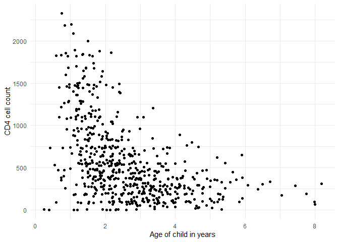
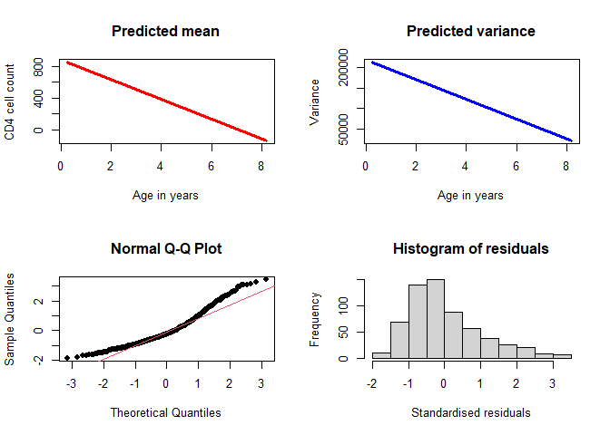
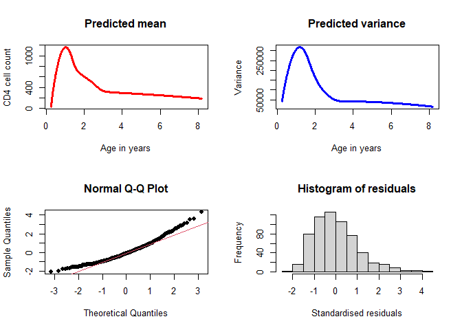
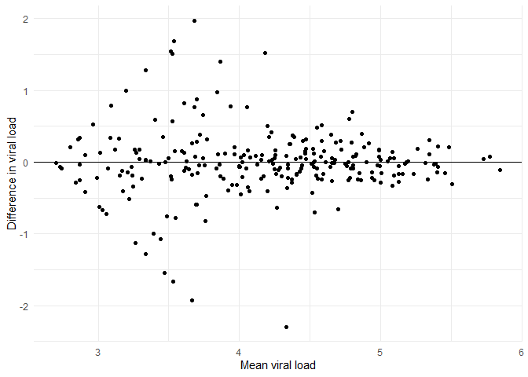

- <a href="#varreg-paper-code" id="toc-varreg-paper-code">VarReg paper
  code</a>
  - <a href="#install-packages" id="toc-install-packages">Install
    packages</a>
  - <a href="#cd4-dataset" id="toc-cd4-dataset">CD4 dataset</a>
  - <a href="#viral-load-dataset" id="toc-viral-load-dataset">Viral load
    dataset</a>

# VarReg paper code

This repository is for the data and code presented in the paper
published here (to be added).

## Install packages

Firstly, you will need to install the `VarReg` package and a few others
to perform the code below.

``` r
library(VarReg)
library(gamlss) #for the CD4 dataset
library(tidyverse)
library(kableExtra)
rna<-read.csv(file="rna.csv") #load rna dataset
```

## CD4 dataset

This dataset is located within the `gamlss` package. CD4 is a type of
white blood cell, and in this dataset, it has been measured in
uninfected children born from HIV-1 infected women. The dataset contains
609 measurements of CD4 cell counts and the child’s age at which the
measurements were taken.

``` r
data("CD4")

str(CD4)
```

    ## 'data.frame':    609 obs. of  2 variables:
    ##  $ cd4: num  387 2183 904 1681 656 ...
    ##  $ age: num  4.5 0.83 2.06 1.44 2.67 1.17 1.94 1.72 2.54 1.66 ...

Lets reproduce the graphic in the paper, showing that at younger ages
there is more variation in the CD4 counts than at older ages,
demonstrating heteroscedasticity.

``` r
ggplot(data=CD4, aes(y=cd4, x=age)) +
  geom_point()+
  xlab("Age of child in years")+
  ylab("CD4 cell count")+
  theme_minimal()
```

<!-- -->

### Linear model in mean and variance

Let us fit a linear model in the mean and variance model, like so

``` r
cd4.linear<-semiVarReg(y = CD4$cd4, 
                       x=CD4$age, 
                       meanmodel = "linear", 
                       varmodel = "linear", 
                       maxit=10000)
```

key outputs for model fit:

``` r
cd4.linear$aic
```

    ## [1] 8999.12

``` r
cd4.linear$bic
```

    ## [1] 9016.767

Key estimates from model:

``` r
cd4.linear$mean
```

    ## Intercept   CD4$age 
    ##  884.7263 -124.8084

``` r
cd4.linear$variance
```

    ## Intercept   CD4$age 
    ## 218069.56 -23922.79

### Visualise the model with `plotVarReg` function:

``` r
plotVarReg(cd4.linear, xlab = "Age in years", ylab = "CD4 cell count")
```

<!-- -->

### Searching for the optimal spline

Searching to a max of 7 knots in the mean and variance, with maximum
iterations (`maxit`) of 100 to minimise time taken for the search:

``` r
cd4.best <- searchVarReg(y=CD4$cd4, 
                         x=CD4$age, 
                         maxknots.m = 7, 
                         maxknots.v = 7, 
                         selection="AIC", 
                         maxit=100) 
```

lets look at the AIC table to identify where the best model is located:

``` r
cd4.best$AIC
```

    ##              Mean_zero Mean_constant Mean_linear Mean_Knot0 Mean_Knot1
    ## Var_constant  9750.800      9205.697    9044.145   8995.636   8997.324
    ## Var_linear    9662.433      9157.150    8999.804   8919.514   8916.172
    ## Var_Knot0     9554.869      9157.147    8947.772   8839.196   8834.943
    ## Var_Knot1     9569.405      9071.485    8904.234   8843.905   8843.712
    ## Var_Knot2     9529.277      8998.794    8897.034   8842.428   8843.873
    ## Var_Knot3     9524.547      8989.098    8892.297   8845.462   8847.495
    ## Var_Knot4     9526.038      8989.595    8893.074   8848.011   8849.848
    ## Var_Knot5     9525.887      8985.381    8893.981   8849.504   8851.418
    ## Var_Knot6     9527.429      8987.042    8895.133   8851.729   8853.584
    ## Var_Knot7     9530.447      8988.579    8896.649   8852.372   8854.234
    ##              Mean_Knot2 Mean_Knot3 Mean_Knot4 Mean_Knot5 Mean_Knot6 Mean_Knot7
    ## Var_constant   8976.977   8972.057   8967.595   8966.348   8964.831   8964.573
    ## Var_linear     8893.389   8889.809   8886.373   8885.619   8884.546   8884.719
    ## Var_Knot0      8862.480   8890.607   8905.680   8912.820   8916.547   8920.788
    ## Var_Knot1      8827.579   8825.414   8823.567   8823.251   8822.785   8823.612
    ## Var_Knot2      8810.478   8804.045   8799.112   8797.778   8797.272   8798.476
    ## Var_Knot3      8809.034   8802.154   8797.212   8796.155   8795.645   8796.823
    ## Var_Knot4      8813.236   8805.825   8801.343   8800.640   8800.177   8801.278
    ## Var_Knot5      8809.139   8803.708   8800.016   8799.135   8798.866   8800.097
    ## Var_Knot6      8810.938   8804.912   8801.297   8800.626   8800.376   8801.441
    ## Var_Knot7      8813.169   8807.877   8804.331   8803.412   8803.204   8804.441

The best model is saved within the `cd4.best` list. The key estimates
from the best model are:

``` r
cd4.best$best.model$mean
```

    ##    Intercept M_Knt6_Base1 M_Knt6_Base2 M_Knt6_Base3 M_Knt6_Base4 M_Knt6_Base5 
    ##     32.98833   1597.06078    713.32197    582.58478    472.08281    291.50092 
    ## M_Knt6_Base6 M_Knt6_Base7 M_Knt6_Base8 
    ##    269.24506    220.66235    155.83254

``` r
cd4.best$best.model$variance
```

    ##    Intercept V_Knt3_Base1 V_Knt3_Base2 V_Knt3_Base3 V_Knt3_Base4 V_Knt3_Base5 
    ##   40801.4581  411830.6370  109290.5901    2784.9777     914.4245  -25616.3670

We can then plot this best model:

``` r
plotVarReg(cd4.best$best.model, 
           xlab = "Age in years", 
           ylab = "CD4 cell count")
```

<!-- -->

From these residuals, there still appears to be deviations from
normality in the residuals, again seen in both the Q-Q plot and the
histogram. Therefore the incorporation of a shape parameter should be
investigated.

### `lssVarReg` function

In order to fit models with a shape parameter, we utilise the
`lssVarReg()` function. Firstly, let us fit a constant shape parameter
with 6 knots in the mean and 3 knots in the variance, that is,

Let us fit two models, one with a constant shape parameter and one with
a linear model in the shape, with the following code.

``` r
con.shape<-lssVarReg(y=CD4$cd4, 
                     x=CD4$age, 
                     locationmodel="semi", 
                     knots.l=6, 
                     scale2model="semi", 
                     knots.sc=3, 
                     mono.scale = "inc", 
                     shapemodel="constant",   
                     maxit=1000 )

linear.shape<-lssVarReg(y=CD4$cd4, 
                        x=CD4$age, 
                        locationmodel="semi", 
                        knots.l=6, 
                        scale2model="semi", 
                        knots.sc=3,  
                        shapemodel="linear", 
                        int.maxit=1000, 
                        print.it=TRUE, 
                        maxit=1000 )
```

If we want to speed up the model, we can use starting estimates (from
our best model) and parameter space restrictions, like so for the
constant model:

``` r
con.shape_faster <- lssVarReg(y=CD4$cd4, x=CD4$age, 
                              locationmodel="semi", 
                              knots.l=6, 
                              scale2model="semi", 
                              knots.sc=3,  
                              shapemodel="constant",  
                              para.space="positive", 
                              location.init = cd4.best$best.model$mean, 
                              scale2.init = cd4.best$best.model$variance,
                              int.maxit = 10000,
                              maxit=1000 )
```

And compare the models as we did in the paper:

``` r
data.frame(Model = c("No shape", "Constant shape", "Linear shape"), 
           AIC = c(cd4.best$best.model$aic, con.shape$aic, linear.shape$aic), 
           BIC = c(cd4.best$best.model$bic, con.shape$bic, linear.shape$bic)) %>% 
  kbl(digits=1, 
      align='c', 
      caption = "Comparison of AIC from shape models for CD4 cell counts.") %>%
  kable_paper(full_width = TRUE ) 
```

<table class=" lightable-paper" style="font-family: &quot;Arial Narrow&quot;, arial, helvetica, sans-serif; margin-left: auto; margin-right: auto;">
<caption>
Comparison of AIC from shape models for CD4 cell counts.
</caption>
<thead>
<tr>
<th style="text-align:center;">
Model
</th>
<th style="text-align:center;">
AIC
</th>
<th style="text-align:center;">
BIC
</th>
</tr>
</thead>
<tbody>
<tr>
<td style="text-align:center;">
No shape
</td>
<td style="text-align:center;">
8795.6
</td>
<td style="text-align:center;">
8861.8
</td>
</tr>
<tr>
<td style="text-align:center;">
Constant shape
</td>
<td style="text-align:center;">
8697.7
</td>
<td style="text-align:center;">
8768.3
</td>
</tr>
<tr>
<td style="text-align:center;">
Linear shape
</td>
<td style="text-align:center;">
8687.1
</td>
<td style="text-align:center;">
8762.1
</td>
</tr>
</tbody>
</table>

And compare the residuals:

``` r
n<-length(CD4$age)
knot6<-bs(CD4$age, df= 8, degree=2)
knot3<-bs(CD4$age, df= 5, degree=2)

##normal model
npred.mean<-colSums(t(cbind(rep(1,n),knot6))*cd4.best$best.model$mean)
npred.var<-colSums(t(cbind(rep(1,n),knot3))*cd4.best$best.model$variance)

stand.res<- (CD4$cd4-npred.mean)**2/(npred.var)
chiq<-qchisq(c(1:n)/(n+1), df=1)

#constant residuals
con.res<-lss_calc(con.shape)
con.res<-con.res[order(con.res$CD4.age),]

#linear residuals
lin.res<-lss_calc(linear.shape)
lin.res<-lin.res[order(lin.res$CD4.age),]

par(mfrow=c(1,3))
plot(chiq, sort(stand.res), main=NULL, ylim=c(0, 10), pch=19, ylab="Squared standardised residuals after fit with no shape", xlab="Chi-Square(1) quantiles")
abline(0,1)
mtext('A', side=3, line=2, at=0, adj=3)

plot(chiq, sort(con.res$stand.res2), main=NULL, ylim=c(0, 10),pch=19, ylab="Squared standardised residuals after LSS (constant) fit", xlab="Chi-Square(1) quantiles")
abline(0,1)
mtext('B', side=3, line=2, at=0, adj=3)
plot(chiq, sort(lin.res$stand.res2), main=NULL, ylim=c(0, 10),pch=19, ylab="Squared standardised residuals after LSS (linear) fit", xlab="Chi-Square(1) quantiles")
abline(0,1)
mtext('C', side=3, line=2, at=0, adj=3)
```

<!-- -->

## Viral load dataset

This is a dataset of the HIV viral load (blood concentration of HIV RNA
on a log10 scale) measured in 257 participants. Prior to commencing a
clinical trial, participants had their blood assayed twice during a
short period of time. Although the underlying viral load is unchanged in
this time, the readings will differ due to measurement error. Another
important aspect is that measurements cannot be detected below a
particular assay limit, in this case, 2.70.

Lets plot the data:

``` r
ggplot(rna, aes(x=x, y=y))+
  geom_point()+
  geom_hline(yintercept = 0)+
  xlab("Mean viral load")+
  ylab("Difference in viral load")+
  theme_minimal()
```

<!-- -->

Now let us search for the optimal knots, using the censoring indicator
and

Monotonic decreasing model:

``` r
rna.best <- searchVarReg(y=rna$y, 
                         x=rna$x, 
                         maxknots.m = 5, 
                         maxknots.v = 5,
                         mono.var = "dec",  
                         selection="AIC", 
                         maxit=1000)  
```

AIC from all models:

``` r
rna.best$AIC %>%
  kbl()
```

<table>
<thead>
<tr>
<th style="text-align:left;">
</th>
<th style="text-align:right;">
Mean_zero
</th>
<th style="text-align:right;">
Mean_constant
</th>
<th style="text-align:right;">
Mean_linear
</th>
<th style="text-align:right;">
Mean_Knot0
</th>
<th style="text-align:right;">
Mean_Knot1
</th>
<th style="text-align:right;">
Mean_Knot2
</th>
<th style="text-align:right;">
Mean_Knot3
</th>
<th style="text-align:right;">
Mean_Knot4
</th>
<th style="text-align:right;">
Mean_Knot5
</th>
</tr>
</thead>
<tbody>
<tr>
<td style="text-align:left;">
Var_constant
</td>
<td style="text-align:right;">
356.5785
</td>
<td style="text-align:right;">
358.5707
</td>
<td style="text-align:right;">
360.6546
</td>
<td style="text-align:right;">
362.3714
</td>
<td style="text-align:right;">
364.4168
</td>
<td style="text-align:right;">
366.8289
</td>
<td style="text-align:right;">
367.6413
</td>
<td style="text-align:right;">
367.9895
</td>
<td style="text-align:right;">
370.2163
</td>
</tr>
<tr>
<td style="text-align:left;">
Var_linear
</td>
<td style="text-align:right;">
343.7177
</td>
<td style="text-align:right;">
344.9826
</td>
<td style="text-align:right;">
346.5864
</td>
<td style="text-align:right;">
343.8347
</td>
<td style="text-align:right;">
346.0263
</td>
<td style="text-align:right;">
346.8374
</td>
<td style="text-align:right;">
348.1985
</td>
<td style="text-align:right;">
349.6518
</td>
<td style="text-align:right;">
351.8708
</td>
</tr>
<tr>
<td style="text-align:left;">
Var_Knot0
</td>
<td style="text-align:right;">
308.8055
</td>
<td style="text-align:right;">
310.4113
</td>
<td style="text-align:right;">
312.4006
</td>
<td style="text-align:right;">
313.9760
</td>
<td style="text-align:right;">
314.7392
</td>
<td style="text-align:right;">
316.4534
</td>
<td style="text-align:right;">
318.5436
</td>
<td style="text-align:right;">
319.1087
</td>
<td style="text-align:right;">
321.1579
</td>
</tr>
<tr>
<td style="text-align:left;">
Var_Knot1
</td>
<td style="text-align:right;">
301.4472
</td>
<td style="text-align:right;">
303.0993
</td>
<td style="text-align:right;">
305.0089
</td>
<td style="text-align:right;">
306.8271
</td>
<td style="text-align:right;">
307.8614
</td>
<td style="text-align:right;">
309.2471
</td>
<td style="text-align:right;">
311.4720
</td>
<td style="text-align:right;">
311.7593
</td>
<td style="text-align:right;">
313.6094
</td>
</tr>
<tr>
<td style="text-align:left;">
Var_Knot2
</td>
<td style="text-align:right;">
300.1673
</td>
<td style="text-align:right;">
301.7458
</td>
<td style="text-align:right;">
303.7286
</td>
<td style="text-align:right;">
305.3120
</td>
<td style="text-align:right;">
306.4286
</td>
<td style="text-align:right;">
307.9999
</td>
<td style="text-align:right;">
310.1779
</td>
<td style="text-align:right;">
310.2592
</td>
<td style="text-align:right;">
312.2001
</td>
</tr>
<tr>
<td style="text-align:left;">
Var_Knot3
</td>
<td style="text-align:right;">
300.9149
</td>
<td style="text-align:right;">
302.5506
</td>
<td style="text-align:right;">
304.5162
</td>
<td style="text-align:right;">
306.0208
</td>
<td style="text-align:right;">
307.1521
</td>
<td style="text-align:right;">
308.7526
</td>
<td style="text-align:right;">
310.9145
</td>
<td style="text-align:right;">
310.9542
</td>
<td style="text-align:right;">
312.9245
</td>
</tr>
<tr>
<td style="text-align:left;">
Var_Knot4
</td>
<td style="text-align:right;">
302.4560
</td>
<td style="text-align:right;">
304.1922
</td>
<td style="text-align:right;">
306.0404
</td>
<td style="text-align:right;">
307.6574
</td>
<td style="text-align:right;">
308.7030
</td>
<td style="text-align:right;">
310.1801
</td>
<td style="text-align:right;">
312.3732
</td>
<td style="text-align:right;">
312.4624
</td>
<td style="text-align:right;">
314.4230
</td>
</tr>
<tr>
<td style="text-align:left;">
Var_Knot5
</td>
<td style="text-align:right;">
301.8835
</td>
<td style="text-align:right;">
303.5299
</td>
<td style="text-align:right;">
305.4762
</td>
<td style="text-align:right;">
306.8321
</td>
<td style="text-align:right;">
307.9106
</td>
<td style="text-align:right;">
309.6258
</td>
<td style="text-align:right;">
311.7526
</td>
<td style="text-align:right;">
312.0656
</td>
<td style="text-align:right;">
313.7795
</td>
</tr>
</tbody>
</table>

Find the smallest AIC:

``` r
min(rna.best$AIC)
```

    ## [1] 300.1673

Allows increasing and decreasing:

``` r
rna.best2 <- searchVarReg(y=rna$y, 
                          x=rna$x, 
                          cens.ind = rna$cc,
                          maxknots.m = 5, 
                          maxknots.v = 5,
                          selection="AIC", 
                          maxit=1000)
```

AIC from all models:

``` r
rna.best$AIC
```

    ##              Mean_zero Mean_constant Mean_linear Mean_Knot0 Mean_Knot1
    ## Var_constant  356.5785      358.5707    360.6546   362.3714   364.4168
    ## Var_linear    343.7177      344.9826    346.5864   343.8347   346.0263
    ## Var_Knot0     308.8055      310.4113    312.4006   313.9760   314.7392
    ## Var_Knot1     301.4472      303.0993    305.0089   306.8271   307.8614
    ## Var_Knot2     300.1673      301.7458    303.7286   305.3120   306.4286
    ## Var_Knot3     300.9149      302.5506    304.5162   306.0208   307.1521
    ## Var_Knot4     302.4560      304.1922    306.0404   307.6574   308.7030
    ## Var_Knot5     301.8835      303.5299    305.4762   306.8321   307.9106
    ##              Mean_Knot2 Mean_Knot3 Mean_Knot4 Mean_Knot5
    ## Var_constant   366.8289   367.6413   367.9895   370.2163
    ## Var_linear     346.8374   348.1985   349.6518   351.8708
    ## Var_Knot0      316.4534   318.5436   319.1087   321.1579
    ## Var_Knot1      309.2471   311.4720   311.7593   313.6094
    ## Var_Knot2      307.9999   310.1779   310.2592   312.2001
    ## Var_Knot3      308.7526   310.9145   310.9542   312.9245
    ## Var_Knot4      310.1801   312.3732   312.4624   314.4230
    ## Var_Knot5      309.6258   311.7526   312.0656   313.7795

Smallest AIC:

``` r
min(rna.best2$AIC)
```

    ## [1] 299.3517
