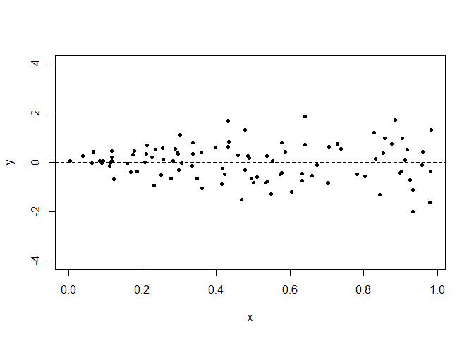
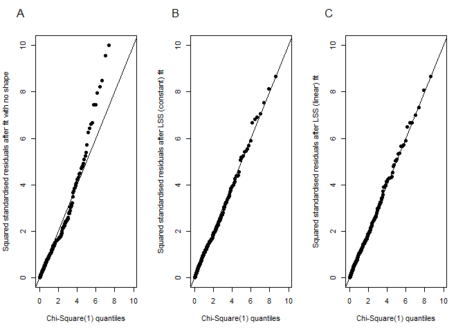

- [VarReg paper code](#varreg-paper-code)
  - [Install packages](#install-packages)
  - [Simple instability example](#simple-instability-example)
  - [CD4 dataset](#cd4-dataset)
  - [Viral load dataset (censored outcome
    data)](#viral-load-dataset-censored-outcome-data)
- [Reproducibility report](#reproducibility-report)

# VarReg paper code

This repository is for the data and code presented in the paper
published here (to be added).

## Install packages

Firstly, you will need to install the `VarReg` package and a few others
to perform the code below.

``` r
library(VarReg)
library(gamlss) #for the CD4 dataset
```

    ## Warning: package 'gamlss' was built under R version 4.4.3

``` r
library(tidyverse)
```

    ## Warning: package 'ggplot2' was built under R version 4.4.3

    ## Warning: package 'purrr' was built under R version 4.4.3

``` r
library(kableExtra)
rna<-read.csv(file="rna.csv") #load rna dataset
```

## Simple instability example

``` r
load("gamlss.error4.Rdata") #  load the gamlss error data

# the data were simulated from a mean 0, linear variance model (variance=0+x)
y<-gamlss.error4[,1]
x<-gamlss.error4[,2]

# plot
plot(x,y, ylim=c(-4,4), pch=20)
abline(h=0, lty="dashed")
```

<!-- -->

Setup link function for gamlss model to model variance

``` r
# specify own link function as the square function for the sigma parameter 
# (sigma^2)
own.linkfun<-function(mu) mu^2
own.linkinv<-function(eta) eta^(1/2)
own.mu.eta<-function (eta) (1/2)*eta^(-1/2)
own.valideta<-function (eta) all(eta >= 0)
```

Try fitting gamlss model:

``` r
gamlssfit<-gamlss(y~-1,
                sigma.formula=~x,
                family=NO(sigma.link="own"))
```

    ## Error in if (dv > olddv && itn >= 2 && auto == TRUE) {: missing value where TRUE/FALSE needed

fails, try starting point and include traces

``` r
gamlssfit<-gamlss(y~-1,
                sigma.formula=~x,
                family=NO(sigma.link="own"),
                sigma.start=c(1,1),
                control=gamlss.control(trace=TRUE),
                i.control=glim.control(glm.trace=TRUE))
```

    ## GLIM iteration 1 for mu: Global Deviance = 236.9006 
    ## GLIM iteration 2 for mu: Global Deviance = 236.9006 
    ## GLIM iteration 1 for sigma: Global Deviance = 195.9834

    ## Error in if (dv > olddv && itn >= 2 && auto == TRUE) {: missing value where TRUE/FALSE needed

still fails, try smaller step size

``` r
gamlssfit<-gamlss(y~-1,
                sigma.formula=~x,
                family=NO(sigma.link="own"),
                sigma.start=c(1,1),
                control=gamlss.control(trace=TRUE,sigma.step=0.01),
                i.control=glim.control(glm.trace=TRUE))
```

    ## GLIM iteration 1 for mu: Global Deviance = 236.9006 
    ## GLIM iteration 2 for mu: Global Deviance = 236.9006 
    ## GLIM iteration 1 for sigma: Global Deviance = 195.9834 
    ## GLIM iteration 2 for sigma: Global Deviance = 195.9556 
    ## GLIM iteration 3 for sigma: Global Deviance = 195.9281 
    ## GLIM iteration 4 for sigma: Global Deviance = 195.9008 
    ## GLIM iteration 5 for sigma: Global Deviance = 195.8737 
    ## GLIM iteration 6 for sigma: Global Deviance = 195.847 
    ## GLIM iteration 7 for sigma: Global Deviance = 195.8205 
    ## GLIM iteration 8 for sigma: Global Deviance = 195.7942 
    ## GLIM iteration 9 for sigma: Global Deviance = 195.7682 
    ## GLIM iteration 10 for sigma: Global Deviance = 195.7424 
    ## GLIM iteration 11 for sigma: Global Deviance = 195.7169 
    ## GLIM iteration 12 for sigma: Global Deviance = 195.6916 
    ## GLIM iteration 13 for sigma: Global Deviance = 195.6666 
    ## GLIM iteration 14 for sigma: Global Deviance = 195.6418 
    ## GLIM iteration 15 for sigma: Global Deviance = 195.6172 
    ## GLIM iteration 16 for sigma: Global Deviance = 195.5929 
    ## GLIM iteration 17 for sigma: Global Deviance = 195.5688 
    ## GLIM iteration 18 for sigma: Global Deviance = 195.5449 
    ## GLIM iteration 19 for sigma: Global Deviance = 195.5213 
    ## GLIM iteration 20 for sigma: Global Deviance = 195.4979 
    ## GLIM iteration 21 for sigma: Global Deviance = 195.4747 
    ## GLIM iteration 22 for sigma: Global Deviance = 195.4517 
    ## GLIM iteration 23 for sigma: Global Deviance = 195.4289 
    ## GLIM iteration 24 for sigma: Global Deviance = 195.4064 
    ## GLIM iteration 25 for sigma: Global Deviance = 195.3841 
    ## GLIM iteration 26 for sigma: Global Deviance = 195.3619 
    ## GLIM iteration 27 for sigma: Global Deviance = 195.34 
    ## GLIM iteration 28 for sigma: Global Deviance = 195.3183 
    ## GLIM iteration 29 for sigma: Global Deviance = 195.2968 
    ## GLIM iteration 30 for sigma: Global Deviance = 195.2755 
    ## GLIM iteration 31 for sigma: Global Deviance = 195.2545 
    ## GLIM iteration 32 for sigma: Global Deviance = 195.2336 
    ## GLIM iteration 33 for sigma: Global Deviance = 195.2129 
    ## GLIM iteration 34 for sigma: Global Deviance = 195.1924 
    ## GLIM iteration 35 for sigma: Global Deviance = 195.172 
    ## GLIM iteration 36 for sigma: Global Deviance = 195.1519 
    ## GLIM iteration 37 for sigma: Global Deviance = 195.132 
    ## GLIM iteration 38 for sigma: Global Deviance = 195.1122 
    ## GLIM iteration 39 for sigma: Global Deviance = 195.0927 
    ## GLIM iteration 40 for sigma: Global Deviance = 195.0733 
    ## GLIM iteration 41 for sigma: Global Deviance = 195.0541 
    ## GLIM iteration 42 for sigma: Global Deviance = 195.0351 
    ## GLIM iteration 43 for sigma: Global Deviance = 195.0162 
    ## GLIM iteration 44 for sigma: Global Deviance = 194.9975 
    ## GLIM iteration 45 for sigma: Global Deviance = 194.979 
    ## GLIM iteration 46 for sigma: Global Deviance = 194.9607 
    ## GLIM iteration 47 for sigma: Global Deviance = 194.9425 
    ## GLIM iteration 48 for sigma: Global Deviance = 194.9246 
    ## GLIM iteration 49 for sigma: Global Deviance = 194.9067 
    ## GLIM iteration 50 for sigma: Global Deviance = 194.8891 
    ## GAMLSS-RS iteration 1: Global Deviance = 194.8891 
    ## GLIM iteration 1 for mu: Global Deviance = 194.8891

    ## Error in glim.fit(f = sigma.object, X = sigma.X, y = y, w = w, fv = sigma, : fitted values in the inner iteration out of range

step reduction doesn’t work, try step halving

``` r
gamlssfit<-gamlss(y~-1,
                    sigma.formula=~x,
                    family=NO(sigma.link="own"),
                    sigma.start=c(1,1),
                    control=gamlss.control(trace=TRUE,sigma.step=0.5,
                                           n.cyc = 100),
                    i.control=glim.control(glm.trace=TRUE))
```

    ## GLIM iteration 1 for mu: Global Deviance = 236.9006 
    ## GLIM iteration 2 for mu: Global Deviance = 236.9006 
    ## GLIM iteration 1 for sigma: Global Deviance = 195.9834 
    ## GLIM iteration 2 for sigma: Global Deviance = 194.418 
    ## GLIM iteration 3 for sigma: Global Deviance = 193.6557 
    ## GLIM iteration 4 for sigma: Global Deviance = 193.3042 
    ## GLIM iteration 5 for sigma: Global Deviance = 193.1629 
    ## GLIM iteration 6 for sigma: Global Deviance = 193.1164 
    ## GLIM iteration 7 for sigma: Global Deviance = 193.1035 
    ## GLIM iteration 8 for sigma: Global Deviance = 193.1003 
    ## GLIM iteration 9 for sigma: Global Deviance = 193.0996 
    ## GAMLSS-RS iteration 1: Global Deviance = 193.0996 
    ## GLIM iteration 1 for mu: Global Deviance = 193.0996 
    ## GLIM iteration 1 for sigma: Global Deviance = 193.0993 
    ## GAMLSS-RS iteration 2: Global Deviance = 193.0993

works!

``` r
summary(gamlssfit)
```

    ## Warning in summary.gamlss(gamlssfit): summary: vcov has failed, option qr is used instead

    ## ******************************************************************
    ## Family:  c("NO", "Normal") 
    ## 
    ## Call:  
    ## gamlss(formula = y ~ -1, sigma.formula = ~x, family = NO(sigma.link = "own"),  
    ##     sigma.start = c(1, 1), control = gamlss.control(trace = TRUE,  
    ##         sigma.step = 0.5, n.cyc = 100), i.control = glim.control(glm.trace = TRUE)) 
    ## 
    ## 
    ## Fitting method: RS() 
    ## 
    ## ------------------------------------------------------------------
    ## Sigma link function:  own
    ## Sigma Coefficients:
    ##              Estimate Std. Error t value Pr(>|t|)    
    ## (Intercept) -0.001975   0.003326  -0.594    0.554    
    ## x            1.084330   0.155735   6.963 3.84e-10 ***
    ## ---
    ## Signif. codes:  0 '***' 0.001 '**' 0.01 '*' 0.05 '.' 0.1 ' ' 1
    ## 
    ## ------------------------------------------------------------------
    ## No. of observations in the fit:  100 
    ## Degrees of Freedom for the fit:  2
    ##       Residual Deg. of Freedom:  98 
    ##                       at cycle:  2 
    ##  
    ## Global Deviance:     193.0993 
    ##             AIC:     197.0993 
    ##             SBC:     202.3097 
    ## ******************************************************************

``` r
gamlssfit$aic
```

    ## [1] 197.0993

``` r
logLik(gamlssfit)
```

    ## 'log Lik.' -96.54967 (df=2)

Try VarReg:

``` r
varreg_fit <- semiVarReg(y = y,
                         x = x,
                         meanmodel = "constant",
                         varmodel = "linear",
                         maxit = 10000)
```

``` r
varreg_fit$variance
```

    ##    Intercept            x 
    ## -0.004179258  1.083872559

``` r
varreg_fit$aic
```

    ## [1] 193.1608

``` r
varreg_fit$loglik
```

    ## [1] -93.58039

``` r
varreg_fit$boundary
```

    ## [1] FALSE

## CD4 dataset

This dataset is located within the `gamlss` package. CD4 is a type of
white blood cell, and in this dataset, it has been measured in
uninfected children born from HIV-1 infected women. The dataset contains
609 measurements of CD4 cell counts and the child’s age at which the
measurements were taken.

``` r
data("CD4")

str(CD4)
```

    ## 'data.frame':    609 obs. of  2 variables:
    ##  $ cd4: num  387 2183 904 1681 656 ...
    ##  $ age: num  4.5 0.83 2.06 1.44 2.67 1.17 1.94 1.72 2.54 1.66 ...

Lets reproduce the graphic in the paper, showing that at younger ages
there is more variation in the CD4 counts than at older ages,
demonstrating heteroscedasticity.

``` r
ggplot(data=CD4, aes(y=cd4, x=age)) +
  geom_point()+
  xlab("Age of child in years")+
  ylab("CD4 cell count")+
  theme_minimal()
```

<!-- -->

### Linear model in mean and variance

Let us fit a linear model in the mean and variance model, like so

``` r
cd4.linear<-semiVarReg(y = CD4$cd4, 
                       x=CD4$age, 
                       meanmodel = "linear", 
                       varmodel = "linear", 
                       maxit=10000)
```

key outputs for model fit:

``` r
cd4.linear$aic
```

    ## [1] 8999.12

``` r
cd4.linear$bic
```

    ## [1] 9016.767

Key estimates from model:

``` r
cd4.linear$mean
```

    ## Intercept   CD4$age 
    ##  884.7263 -124.8084

``` r
cd4.linear$variance
```

    ## Intercept   CD4$age 
    ## 218069.56 -23922.79

### Visualise the model with `plotVarReg` function:

``` r
plotVarReg(cd4.linear, xlab = "Age in years", ylab = "CD4 cell count")
```

<!-- -->

### Searching for the optimal spline

Searching to a max of 7 knots in the mean and variance, with maximum
iterations (`maxit`) of 100 to minimise time taken for the search:

``` r
cd4.best <- searchVarReg(y=CD4$cd4, 
                         x=CD4$age, 
                         maxknots.m = 7, 
                         maxknots.v = 7, 
                         selection="AIC", 
                         maxit=100) 
```

lets look at the AIC table to identify where the best model is located:

``` r
cd4.best$AIC %>%
  kbl(digits=1)
```

<table>

<thead>

<tr>

<th style="text-align:left;">

</th>

<th style="text-align:right;">

Mean_zero
</th>

<th style="text-align:right;">

Mean_constant
</th>

<th style="text-align:right;">

Mean_linear
</th>

<th style="text-align:right;">

Mean_Knot0
</th>

<th style="text-align:right;">

Mean_Knot1
</th>

<th style="text-align:right;">

Mean_Knot2
</th>

<th style="text-align:right;">

Mean_Knot3
</th>

<th style="text-align:right;">

Mean_Knot4
</th>

<th style="text-align:right;">

Mean_Knot5
</th>

<th style="text-align:right;">

Mean_Knot6
</th>

<th style="text-align:right;">

Mean_Knot7
</th>

</tr>

</thead>

<tbody>

<tr>

<td style="text-align:left;">

Var_constant
</td>

<td style="text-align:right;">

9750.8
</td>

<td style="text-align:right;">

9205.7
</td>

<td style="text-align:right;">

9044.1
</td>

<td style="text-align:right;">

8995.6
</td>

<td style="text-align:right;">

8997.3
</td>

<td style="text-align:right;">

8977.0
</td>

<td style="text-align:right;">

8972.1
</td>

<td style="text-align:right;">

8967.6
</td>

<td style="text-align:right;">

8966.3
</td>

<td style="text-align:right;">

8964.8
</td>

<td style="text-align:right;">

8964.6
</td>

</tr>

<tr>

<td style="text-align:left;">

Var_linear
</td>

<td style="text-align:right;">

9662.4
</td>

<td style="text-align:right;">

9157.1
</td>

<td style="text-align:right;">

8999.8
</td>

<td style="text-align:right;">

8919.5
</td>

<td style="text-align:right;">

8916.2
</td>

<td style="text-align:right;">

8893.4
</td>

<td style="text-align:right;">

8889.8
</td>

<td style="text-align:right;">

8886.4
</td>

<td style="text-align:right;">

8885.6
</td>

<td style="text-align:right;">

8884.5
</td>

<td style="text-align:right;">

8884.7
</td>

</tr>

<tr>

<td style="text-align:left;">

Var_Knot0
</td>

<td style="text-align:right;">

9554.9
</td>

<td style="text-align:right;">

9157.1
</td>

<td style="text-align:right;">

8947.8
</td>

<td style="text-align:right;">

8839.2
</td>

<td style="text-align:right;">

8834.9
</td>

<td style="text-align:right;">

8862.5
</td>

<td style="text-align:right;">

8890.6
</td>

<td style="text-align:right;">

8905.7
</td>

<td style="text-align:right;">

8912.8
</td>

<td style="text-align:right;">

8916.5
</td>

<td style="text-align:right;">

8920.8
</td>

</tr>

<tr>

<td style="text-align:left;">

Var_Knot1
</td>

<td style="text-align:right;">

9569.4
</td>

<td style="text-align:right;">

9071.5
</td>

<td style="text-align:right;">

8904.2
</td>

<td style="text-align:right;">

8843.9
</td>

<td style="text-align:right;">

8843.7
</td>

<td style="text-align:right;">

8827.6
</td>

<td style="text-align:right;">

8825.4
</td>

<td style="text-align:right;">

8823.6
</td>

<td style="text-align:right;">

8823.3
</td>

<td style="text-align:right;">

8822.8
</td>

<td style="text-align:right;">

8823.6
</td>

</tr>

<tr>

<td style="text-align:left;">

Var_Knot2
</td>

<td style="text-align:right;">

9529.3
</td>

<td style="text-align:right;">

8998.8
</td>

<td style="text-align:right;">

8897.0
</td>

<td style="text-align:right;">

8842.4
</td>

<td style="text-align:right;">

8843.9
</td>

<td style="text-align:right;">

8810.5
</td>

<td style="text-align:right;">

8804.0
</td>

<td style="text-align:right;">

8799.1
</td>

<td style="text-align:right;">

8797.8
</td>

<td style="text-align:right;">

8797.3
</td>

<td style="text-align:right;">

8798.5
</td>

</tr>

<tr>

<td style="text-align:left;">

Var_Knot3
</td>

<td style="text-align:right;">

9524.5
</td>

<td style="text-align:right;">

8989.1
</td>

<td style="text-align:right;">

8892.3
</td>

<td style="text-align:right;">

8845.5
</td>

<td style="text-align:right;">

8847.5
</td>

<td style="text-align:right;">

8809.0
</td>

<td style="text-align:right;">

8802.2
</td>

<td style="text-align:right;">

8797.2
</td>

<td style="text-align:right;">

8796.2
</td>

<td style="text-align:right;">

8795.6
</td>

<td style="text-align:right;">

8796.8
</td>

</tr>

<tr>

<td style="text-align:left;">

Var_Knot4
</td>

<td style="text-align:right;">

9526.0
</td>

<td style="text-align:right;">

8989.6
</td>

<td style="text-align:right;">

8893.1
</td>

<td style="text-align:right;">

8848.0
</td>

<td style="text-align:right;">

8849.8
</td>

<td style="text-align:right;">

8813.2
</td>

<td style="text-align:right;">

8805.8
</td>

<td style="text-align:right;">

8801.3
</td>

<td style="text-align:right;">

8800.6
</td>

<td style="text-align:right;">

8800.2
</td>

<td style="text-align:right;">

8801.3
</td>

</tr>

<tr>

<td style="text-align:left;">

Var_Knot5
</td>

<td style="text-align:right;">

9525.9
</td>

<td style="text-align:right;">

8985.4
</td>

<td style="text-align:right;">

8894.0
</td>

<td style="text-align:right;">

8849.5
</td>

<td style="text-align:right;">

8851.4
</td>

<td style="text-align:right;">

8809.1
</td>

<td style="text-align:right;">

8803.7
</td>

<td style="text-align:right;">

8800.0
</td>

<td style="text-align:right;">

8799.1
</td>

<td style="text-align:right;">

8798.9
</td>

<td style="text-align:right;">

8800.1
</td>

</tr>

<tr>

<td style="text-align:left;">

Var_Knot6
</td>

<td style="text-align:right;">

9527.4
</td>

<td style="text-align:right;">

8987.0
</td>

<td style="text-align:right;">

8895.1
</td>

<td style="text-align:right;">

8851.7
</td>

<td style="text-align:right;">

8853.6
</td>

<td style="text-align:right;">

8810.9
</td>

<td style="text-align:right;">

8804.9
</td>

<td style="text-align:right;">

8801.3
</td>

<td style="text-align:right;">

8800.6
</td>

<td style="text-align:right;">

8800.4
</td>

<td style="text-align:right;">

8801.4
</td>

</tr>

<tr>

<td style="text-align:left;">

Var_Knot7
</td>

<td style="text-align:right;">

9530.4
</td>

<td style="text-align:right;">

8988.6
</td>

<td style="text-align:right;">

8896.6
</td>

<td style="text-align:right;">

8852.4
</td>

<td style="text-align:right;">

8854.2
</td>

<td style="text-align:right;">

8813.2
</td>

<td style="text-align:right;">

8807.9
</td>

<td style="text-align:right;">

8804.3
</td>

<td style="text-align:right;">

8803.4
</td>

<td style="text-align:right;">

8803.2
</td>

<td style="text-align:right;">

8804.4
</td>

</tr>

</tbody>

</table>

The best model is saved within the `cd4.best` list. The key estimates
from the best model are:

``` r
cd4.best$best.model$knots.m
```

    ## [1] 6

``` r
cd4.best$best.model$knots.v
```

    ## [1] 3

``` r
cd4.best$best.model$mean
```

    ##    Intercept M_Knt6_Base1 M_Knt6_Base2 M_Knt6_Base3 M_Knt6_Base4 M_Knt6_Base5 
    ##     32.98833   1597.06078    713.32197    582.58478    472.08281    291.50092 
    ## M_Knt6_Base6 M_Knt6_Base7 M_Knt6_Base8 
    ##    269.24506    220.66235    155.83254

``` r
cd4.best$best.model$variance
```

    ##    Intercept V_Knt3_Base1 V_Knt3_Base2 V_Knt3_Base3 V_Knt3_Base4 V_Knt3_Base5 
    ##   40801.4581  411830.6370  109290.5901    2784.9777     914.4245  -25616.3670

ie. 6 knots in mean and 3 in variance, with parameter estimates as
given. We can then plot this best model:

``` r
plotVarReg(cd4.best$best.model, 
           xlab = "Age in years", 
           ylab = "CD4 cell count")
```

<!-- -->

From these residuals, there still appears to be deviations from
normality in the residuals, again seen in both the Q-Q plot and the
histogram. Therefore the incorporation of a shape parameter should be
investigated.

### `lssVarReg` function

In order to fit models with a shape parameter, we utilise the
`lssVarReg()` function. Firstly, let us fit a constant shape parameter
with 6 knots in the mean and 3 knots in the variance, that is,

Let us fit two models, one with a constant shape parameter and one with
a linear model in the shape, with the following code.

``` r
con.shape<-lssVarReg(y=CD4$cd4, 
                     x=CD4$age, 
                     locationmodel="semi", 
                     knots.l=6, 
                     scale2model="semi", 
                     knots.sc=3, 
                     mono.scale = "inc", 
                     shapemodel="constant",   
                     maxit=1000 )

linear.shape<-lssVarReg(y=CD4$cd4, 
                        x=CD4$age, 
                        locationmodel="semi", 
                        knots.l=6, 
                        scale2model="semi", 
                        knots.sc=3,  
                        shapemodel="linear", 
                        int.maxit=1000, 
                        print.it=TRUE, 
                        maxit=1000 )
```

If we want to speed up the model, we can use starting estimates (from
our best model) and parameter space restrictions, like so for the
constant model:

``` r
con.shape_faster <- lssVarReg(y=CD4$cd4, x=CD4$age, 
                              locationmodel="semi", 
                              knots.l=6, 
                              scale2model="semi", 
                              knots.sc=3,  
                              shapemodel="constant",  
                              para.space="positive", 
                              location.init = cd4.best$best.model$mean, 
                              scale2.init = cd4.best$best.model$variance,
                              int.maxit = 10000,
                              maxit=1000 )
```

And compare the models as we did in the paper:

``` r
data.frame(Model = c("No shape", "Constant shape", "Linear shape"), 
           AIC = c(cd4.best$best.model$aic, con.shape$aic, linear.shape$aic), 
           BIC = c(cd4.best$best.model$bic, con.shape$bic, linear.shape$bic)) %>% 
  kbl(digits=1, 
      align='c', 
      caption = "Comparison of AIC from shape models for CD4 cell counts.") %>%
  kable_paper(full_width = TRUE ) 
```

<table class=" lightable-paper" style="color: black; font-family: &quot;Arial Narrow&quot;, arial, helvetica, sans-serif; margin-left: auto; margin-right: auto;">

<caption>

Comparison of AIC from shape models for CD4 cell counts.
</caption>

<thead>

<tr>

<th style="text-align:center;">

Model
</th>

<th style="text-align:center;">

AIC
</th>

<th style="text-align:center;">

BIC
</th>

</tr>

</thead>

<tbody>

<tr>

<td style="text-align:center;">

No shape
</td>

<td style="text-align:center;">

8795.6
</td>

<td style="text-align:center;">

8861.8
</td>

</tr>

<tr>

<td style="text-align:center;">

Constant shape
</td>

<td style="text-align:center;">

8697.7
</td>

<td style="text-align:center;">

8768.3
</td>

</tr>

<tr>

<td style="text-align:center;">

Linear shape
</td>

<td style="text-align:center;">

8687.1
</td>

<td style="text-align:center;">

8762.1
</td>

</tr>

</tbody>

</table>

And compare the residuals:

``` r
n<-length(CD4$age)
knot6<-bs(CD4$age, df= 8, degree=2)
knot3<-bs(CD4$age, df= 5, degree=2)

##normal model
npred.mean<-colSums(t(cbind(rep(1,n),knot6))*cd4.best$best.model$mean)
npred.var<-colSums(t(cbind(rep(1,n),knot3))*cd4.best$best.model$variance)

stand.res<- (CD4$cd4-npred.mean)**2/(npred.var)
chiq<-qchisq(c(1:n)/(n+1), df=1)

#constant residuals
con.res<-lss_calc(con.shape)
con.res<-con.res[order(con.res$CD4.age),]

#linear residuals
lin.res<-lss_calc(linear.shape)
lin.res<-lin.res[order(lin.res$CD4.age),]

par(mfrow=c(1,3))
plot(chiq, sort(stand.res), main=NULL, ylim=c(0, 10), pch=19, ylab="Squared standardised residuals after fit with no shape", xlab="Chi-Square(1) quantiles")
abline(0,1)
mtext('A', side=3, line=2, at=0, adj=3)

plot(chiq, sort(con.res$stand.res2), main=NULL, ylim=c(0, 10),pch=19, ylab="Squared standardised residuals after LSS (constant) fit", xlab="Chi-Square(1) quantiles")
abline(0,1)
mtext('B', side=3, line=2, at=0, adj=3)
plot(chiq, sort(lin.res$stand.res2), main=NULL, ylim=c(0, 10),pch=19, ylab="Squared standardised residuals after LSS (linear) fit", xlab="Chi-Square(1) quantiles")
abline(0,1)
mtext('C', side=3, line=2, at=0, adj=3)
```

<!-- -->

## Viral load dataset (censored outcome data)

This is a dataset of the HIV viral load (blood concentration of HIV RNA
on a log10 scale) measured in 257 participants. Prior to commencing a
clinical trial, participants had their blood assayed twice during a
short period of time. Although the underlying viral load is unchanged in
this time, the readings will differ due to measurement error. Another
important aspect is that measurements cannot be detected below a
particular assay limit, in this case, 2.70.

Lets plot the data:

``` r
ggplot(rna, aes(x=x, y=y))+
  geom_point()+
  geom_hline(yintercept = 0)+
  xlab("Mean viral load")+
  ylab("Difference in viral load")+
  theme_minimal()
```

<!-- -->

Now let us search for the optimal knots, using the censoring indicator
and

Monotonic decreasing model:

``` r
rna.best <- searchVarReg(y=rna$y, 
                         x=rna$x, 
                         maxknots.m = 5, 
                         maxknots.v = 5,
                         mono.var = "dec",  
                         selection="AIC", 
                         maxit=1000)  
```

AIC from all models:

``` r
rna.best$AIC %>%
  kbl(digits=1)
```

<table>

<thead>

<tr>

<th style="text-align:left;">

</th>

<th style="text-align:right;">

Mean_zero
</th>

<th style="text-align:right;">

Mean_constant
</th>

<th style="text-align:right;">

Mean_linear
</th>

<th style="text-align:right;">

Mean_Knot0
</th>

<th style="text-align:right;">

Mean_Knot1
</th>

<th style="text-align:right;">

Mean_Knot2
</th>

<th style="text-align:right;">

Mean_Knot3
</th>

<th style="text-align:right;">

Mean_Knot4
</th>

<th style="text-align:right;">

Mean_Knot5
</th>

</tr>

</thead>

<tbody>

<tr>

<td style="text-align:left;">

Var_constant
</td>

<td style="text-align:right;">

356.6
</td>

<td style="text-align:right;">

358.6
</td>

<td style="text-align:right;">

360.7
</td>

<td style="text-align:right;">

362.4
</td>

<td style="text-align:right;">

364.4
</td>

<td style="text-align:right;">

366.8
</td>

<td style="text-align:right;">

367.6
</td>

<td style="text-align:right;">

368.0
</td>

<td style="text-align:right;">

370.2
</td>

</tr>

<tr>

<td style="text-align:left;">

Var_linear
</td>

<td style="text-align:right;">

343.7
</td>

<td style="text-align:right;">

345.0
</td>

<td style="text-align:right;">

346.6
</td>

<td style="text-align:right;">

343.8
</td>

<td style="text-align:right;">

346.0
</td>

<td style="text-align:right;">

346.8
</td>

<td style="text-align:right;">

348.2
</td>

<td style="text-align:right;">

349.7
</td>

<td style="text-align:right;">

351.9
</td>

</tr>

<tr>

<td style="text-align:left;">

Var_Knot0
</td>

<td style="text-align:right;">

308.8
</td>

<td style="text-align:right;">

310.4
</td>

<td style="text-align:right;">

312.4
</td>

<td style="text-align:right;">

314.0
</td>

<td style="text-align:right;">

314.7
</td>

<td style="text-align:right;">

316.5
</td>

<td style="text-align:right;">

318.5
</td>

<td style="text-align:right;">

319.1
</td>

<td style="text-align:right;">

321.2
</td>

</tr>

<tr>

<td style="text-align:left;">

Var_Knot1
</td>

<td style="text-align:right;">

301.4
</td>

<td style="text-align:right;">

303.1
</td>

<td style="text-align:right;">

305.0
</td>

<td style="text-align:right;">

306.8
</td>

<td style="text-align:right;">

307.9
</td>

<td style="text-align:right;">

309.2
</td>

<td style="text-align:right;">

311.5
</td>

<td style="text-align:right;">

311.8
</td>

<td style="text-align:right;">

313.6
</td>

</tr>

<tr>

<td style="text-align:left;">

Var_Knot2
</td>

<td style="text-align:right;">

300.2
</td>

<td style="text-align:right;">

301.7
</td>

<td style="text-align:right;">

303.7
</td>

<td style="text-align:right;">

305.3
</td>

<td style="text-align:right;">

306.4
</td>

<td style="text-align:right;">

308.0
</td>

<td style="text-align:right;">

310.2
</td>

<td style="text-align:right;">

310.3
</td>

<td style="text-align:right;">

312.2
</td>

</tr>

<tr>

<td style="text-align:left;">

Var_Knot3
</td>

<td style="text-align:right;">

300.9
</td>

<td style="text-align:right;">

302.6
</td>

<td style="text-align:right;">

304.5
</td>

<td style="text-align:right;">

306.0
</td>

<td style="text-align:right;">

307.2
</td>

<td style="text-align:right;">

308.8
</td>

<td style="text-align:right;">

310.9
</td>

<td style="text-align:right;">

311.0
</td>

<td style="text-align:right;">

312.9
</td>

</tr>

<tr>

<td style="text-align:left;">

Var_Knot4
</td>

<td style="text-align:right;">

302.5
</td>

<td style="text-align:right;">

304.2
</td>

<td style="text-align:right;">

306.0
</td>

<td style="text-align:right;">

307.7
</td>

<td style="text-align:right;">

308.7
</td>

<td style="text-align:right;">

310.2
</td>

<td style="text-align:right;">

312.4
</td>

<td style="text-align:right;">

312.5
</td>

<td style="text-align:right;">

314.4
</td>

</tr>

<tr>

<td style="text-align:left;">

Var_Knot5
</td>

<td style="text-align:right;">

301.9
</td>

<td style="text-align:right;">

303.5
</td>

<td style="text-align:right;">

305.5
</td>

<td style="text-align:right;">

306.8
</td>

<td style="text-align:right;">

307.9
</td>

<td style="text-align:right;">

309.6
</td>

<td style="text-align:right;">

311.8
</td>

<td style="text-align:right;">

312.1
</td>

<td style="text-align:right;">

313.8
</td>

</tr>

</tbody>

</table>

Find the smallest AIC:

``` r
min(rna.best$AIC)
```

    ## [1] 300.1673

Allows increasing and decreasing:

``` r
rna.best2 <- searchVarReg(y=rna$y, 
                          x=rna$x, 
                          cens.ind = rna$cc,
                          maxknots.m = 5, 
                          maxknots.v = 5,
                          selection="AIC", 
                          maxit=1000)
```

AIC from all models:

``` r
rna.best2$AIC %>%
  kbl(digits=1)
```

<table>

<thead>

<tr>

<th style="text-align:left;">

</th>

<th style="text-align:right;">

Mean_zero
</th>

<th style="text-align:right;">

Mean_constant
</th>

<th style="text-align:right;">

Mean_linear
</th>

<th style="text-align:right;">

Mean_Knot0
</th>

<th style="text-align:right;">

Mean_Knot1
</th>

<th style="text-align:right;">

Mean_Knot2
</th>

<th style="text-align:right;">

Mean_Knot3
</th>

<th style="text-align:right;">

Mean_Knot4
</th>

<th style="text-align:right;">

Mean_Knot5
</th>

</tr>

</thead>

<tbody>

<tr>

<td style="text-align:left;">

Var_constant
</td>

<td style="text-align:right;">

356.6
</td>

<td style="text-align:right;">

358.6
</td>

<td style="text-align:right;">

360.7
</td>

<td style="text-align:right;">

362.4
</td>

<td style="text-align:right;">

364.4
</td>

<td style="text-align:right;">

366.8
</td>

<td style="text-align:right;">

367.6
</td>

<td style="text-align:right;">

368.0
</td>

<td style="text-align:right;">

370.2
</td>

</tr>

<tr>

<td style="text-align:left;">

Var_linear
</td>

<td style="text-align:right;">

343.7
</td>

<td style="text-align:right;">

345.0
</td>

<td style="text-align:right;">

346.6
</td>

<td style="text-align:right;">

343.8
</td>

<td style="text-align:right;">

346.0
</td>

<td style="text-align:right;">

346.8
</td>

<td style="text-align:right;">

348.2
</td>

<td style="text-align:right;">

349.7
</td>

<td style="text-align:right;">

351.9
</td>

</tr>

<tr>

<td style="text-align:left;">

Var_Knot0
</td>

<td style="text-align:right;">

364.6
</td>

<td style="text-align:right;">

366.1
</td>

<td style="text-align:right;">

368.0
</td>

<td style="text-align:right;">

365.0
</td>

<td style="text-align:right;">

367.1
</td>

<td style="text-align:right;">

368.3
</td>

<td style="text-align:right;">

369.6
</td>

<td style="text-align:right;">

371.0
</td>

<td style="text-align:right;">

373.2
</td>

</tr>

<tr>

<td style="text-align:left;">

Var_Knot1
</td>

<td style="text-align:right;">

323.2
</td>

<td style="text-align:right;">

325.1
</td>

<td style="text-align:right;">

327.0
</td>

<td style="text-align:right;">

327.6
</td>

<td style="text-align:right;">

329.2
</td>

<td style="text-align:right;">

330.9
</td>

<td style="text-align:right;">

333.1
</td>

<td style="text-align:right;">

332.9
</td>

<td style="text-align:right;">

334.4
</td>

</tr>

<tr>

<td style="text-align:left;">

Var_Knot2
</td>

<td style="text-align:right;">

299.4
</td>

<td style="text-align:right;">

300.7
</td>

<td style="text-align:right;">

302.6
</td>

<td style="text-align:right;">

303.1
</td>

<td style="text-align:right;">

304.2
</td>

<td style="text-align:right;">

306.1
</td>

<td style="text-align:right;">

308.1
</td>

<td style="text-align:right;">

308.1
</td>

<td style="text-align:right;">

309.9
</td>

</tr>

<tr>

<td style="text-align:left;">

Var_Knot3
</td>

<td style="text-align:right;">

299.9
</td>

<td style="text-align:right;">

301.3
</td>

<td style="text-align:right;">

303.2
</td>

<td style="text-align:right;">

303.6
</td>

<td style="text-align:right;">

304.8
</td>

<td style="text-align:right;">

306.6
</td>

<td style="text-align:right;">

308.6
</td>

<td style="text-align:right;">

308.6
</td>

<td style="text-align:right;">

310.2
</td>

</tr>

<tr>

<td style="text-align:left;">

Var_Knot4
</td>

<td style="text-align:right;">

300.4
</td>

<td style="text-align:right;">

302.0
</td>

<td style="text-align:right;">

303.8
</td>

<td style="text-align:right;">

304.0
</td>

<td style="text-align:right;">

304.8
</td>

<td style="text-align:right;">

306.5
</td>

<td style="text-align:right;">

308.7
</td>

<td style="text-align:right;">

308.7
</td>

<td style="text-align:right;">

310.7
</td>

</tr>

<tr>

<td style="text-align:left;">

Var_Knot5
</td>

<td style="text-align:right;">

301.5
</td>

<td style="text-align:right;">

303.0
</td>

<td style="text-align:right;">

304.9
</td>

<td style="text-align:right;">

304.7
</td>

<td style="text-align:right;">

305.7
</td>

<td style="text-align:right;">

307.7
</td>

<td style="text-align:right;">

309.7
</td>

<td style="text-align:right;">

310.4
</td>

<td style="text-align:right;">

311.9
</td>

</tr>

</tbody>

</table>

Smallest AIC:

``` r
min(rna.best2$AIC)
```

    ## [1] 299.3517

# Reproducibility report

``` r
sessionInfo()
```

    ## R version 4.4.0 (2024-04-24 ucrt)
    ## Platform: x86_64-w64-mingw32/x64
    ## Running under: Windows 11 x64 (build 26200)
    ## 
    ## Matrix products: default
    ## 
    ## 
    ## locale:
    ## [1] LC_COLLATE=English_Australia.utf8  LC_CTYPE=English_Australia.utf8   
    ## [3] LC_MONETARY=English_Australia.utf8 LC_NUMERIC=C                      
    ## [5] LC_TIME=English_Australia.utf8    
    ## 
    ## time zone: Australia/Sydney
    ## tzcode source: internal
    ## 
    ## attached base packages:
    ## [1] parallel  splines   stats     graphics  grDevices utils     datasets 
    ## [8] methods   base     
    ## 
    ## other attached packages:
    ##  [1] kableExtra_1.4.0  lubridate_1.9.3   forcats_1.0.0     stringr_1.5.1    
    ##  [5] dplyr_1.1.4       purrr_1.0.4       readr_2.1.5       tidyr_1.3.1      
    ##  [9] tibble_3.2.1      ggplot2_4.0.0     tidyverse_2.0.0   gamlss_5.5-0     
    ## [13] nlme_3.1-164      gamlss.dist_6.1-1 gamlss.data_6.0-6 VarReg_2.0       
    ## 
    ## loaded via a namespace (and not attached):
    ##  [1] utf8_1.2.4         generics_0.1.3     xml2_1.3.6         stringi_1.8.4     
    ##  [5] lattice_0.22-6     hms_1.1.3          digest_0.6.35      magrittr_2.0.3    
    ##  [9] timechange_0.3.0   evaluate_1.0.1     grid_4.4.0         RColorBrewer_1.1-3
    ## [13] fastmap_1.2.0      Matrix_1.7-0       survival_3.8-3     fansi_1.0.6       
    ## [17] viridisLite_0.4.2  scales_1.4.0       cli_3.6.4          rlang_1.1.4       
    ## [21] withr_3.0.2        yaml_2.3.10        tools_4.4.0        tzdb_0.4.0        
    ## [25] vctrs_0.6.5        R6_2.5.1           lifecycle_1.0.4    MASS_7.3-60.2     
    ## [29] pkgconfig_2.0.3    pillar_1.9.0       gtable_0.3.6       glue_1.8.0        
    ## [33] systemfonts_1.1.0  xfun_0.51          tidyselect_1.2.1   rstudioapi_0.17.1 
    ## [37] knitr_1.50         farver_2.1.2       htmltools_0.5.8.1  labeling_0.4.3    
    ## [41] svglite_2.1.3      rmarkdown_2.29     compiler_4.4.0     S7_0.2.0
